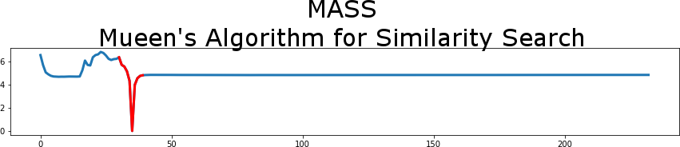

<div style="text-align:center"></div>

Introduction
------------
[](https://twitter.com/intent/tweet?text=Check%20out%20mass-ts!%20MASS%20implementations%20in%20Python%202%20and%203.%20Free%20and%20open%20source.&url=https://github.com/tylerwmarrs/mass-ts&via=tylerwmarrs&hashtags=datascience,datamining,timeseries)

[](https://pypi.python.org/pypi/mass_ts)
[](https://travis-ci.org/tylerwmarrs/mass-ts)

MASS allows you to search a time series for a subquery resulting in an array of distances. These array of distances enable you to identify similar or dissimilar subsequences compared to your query. At its core, MASS computes Euclidean distances under z-normalization in an efficient manner and is domain agnostic in nature. It is the fundamental algorithm that the matrix profile algorithm is built on top of. 

mass-ts is a python 2 and 3 compatible library.

Free software: Apache Software License 2.0


Features
--------

**Original Author's Algorithms**
* MASS - the first implementation of MASS
* MASS2 - the second implementation of MASS that is significantly faster. Typically this is the one you will use.
* MASS3 - a piecewise version of MASS2 that can be tuned to your hardware. Generally this is used to search very large time series.
* MASS_weighted - TODO

**Library Specific Algorithms**
* MASS2_batch - a batch version of MASS2 that reduces overall memory usage, provides parallelization and enables you to find top K number of matches within the time series. The goal of using this implementation is for very large time series similarity search.
* top_k_motifs - find the top K number of similar subsequences to your given query. It returns the starting index of the subsequence.
* top_k_discords - find the top K number of dissimilar subsequences to your given query. It returns the starting index of the subsequence.

Installation
------------
```
pip install mass-ts
```

Example Usage
-------------
A dedicated repository for practical examples can be found at the [mass-ts-examples repository](https://github.com/tylerwmarrs/mass-ts-examples).

```python

import numpy as np
import mass_ts as mts

ts = np.loadtxt('ts.txt')
query = np.loadtxt('query.txt')

# mass
distances = mts.mass(ts, query)

# mass2
distances = mts.mass2(ts, query)

# mass3
distances = mts.mass3(ts, query, 256)

# mass2_batch
# start a multi-threaded batch job with all cpu cores and give me the top 5 matches.
# note that batch_size partitions your time series into a subsequence similarity search.
# even for large time series in single threaded mode, this is much more memory efficient than
# MASS2 on its own.
batch_size = 10000
top_matches = 5
n_jobs = -1
indices, distances = mts.mass2_batch(ts, query, batch_size, 
    top_matches=top_matches, n_jobs=n_jobs)

# find minimum distance
min_idx = np.argmin(distances)

# find top 4 motif starting indices
k = 4
exclusion_zone = 25
top_motifs = mts.top_k_motifs(distances, k, exclusion_zone)

# find top 4 discord starting indices
k = 4
exclusion_zone = 25
top_discords = mts.top_k_discords(distances, k, exclusion_zone)
```

Citations
---------
Abdullah Mueen, Yan Zhu, Michael Yeh, Kaveh Kamgar, Krishnamurthy Viswanathan, Chetan Kumar Gupta and Eamonn Keogh (2015), The Fastest Similarity Search Algorithm for Time Series Subsequences under Euclidean Distance, URL: http://www.cs.unm.edu/~mueen/FastestSimilaritySearch.html
